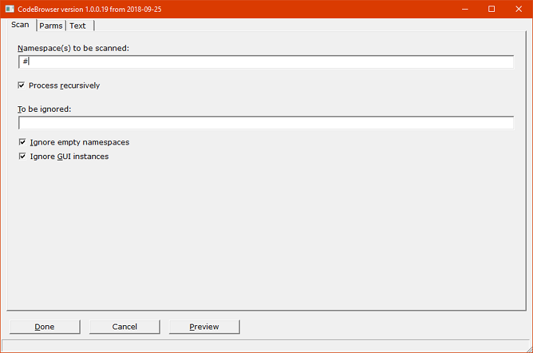
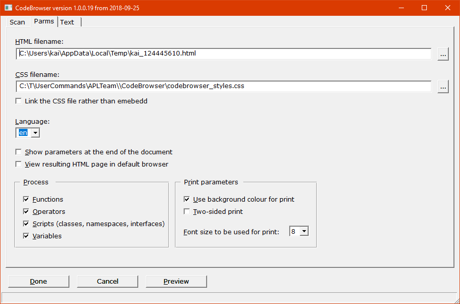
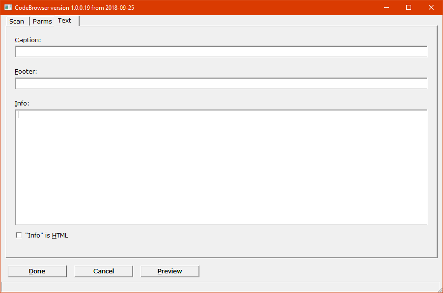

# CodeBrowser

## Overview

`CodeBrowser` allows you to create a stand-alone HTML document with APL code. Its purpose is to provide a tool for documentation and code reviews.

The HTML carries plenty of links. That makes it easy to jump around when reviewing code.

The CSS is optimized for printing the document to make it look nice.

All the CSS and JavaScipt that are required are injected into the HTML file, making it self-contained.
Demo: [CodeBrowser processing itself](http://download.aplteam.com/CodeBrowser_Selfie.html)


## Installation

With version 3.0, `CodeBrowser` became a Tatin package. It can therefore be installed as a user command with this statement:

```
    ]InstallPackages aplteam-CoderBrowser [MyUCMDs]
```
Any newly started instance of Dyalog APL then knows a user commands `]CodeBrowser`.

## Usage

Execute:

```
]CodeBrowser -??
```

for how to run the user command (reference)

For detailed documentation, including examples, enter

```
]CodeBrowser -???
```

Here is a very simple example:

```
]CodeBrowser ⎕se.CodeBrowser -view
```

The `-view` flag stands for "put on display with default browser". This will allow you to check all the code in `⎕SE`.

## Parameters

Although many (though not all) parameters can be specified as flags and options via the user command, to make it possible to run `CodeBrowser` under program control, for a user, the most convenient way is to use the `-gui` flag.

However, although `]CodeBrowser` works on all platforms, the `-gui` flag works under **Windows only**.

It lets the user command show a GUI that allows her to define all parameters she wants to amend comfortably:


